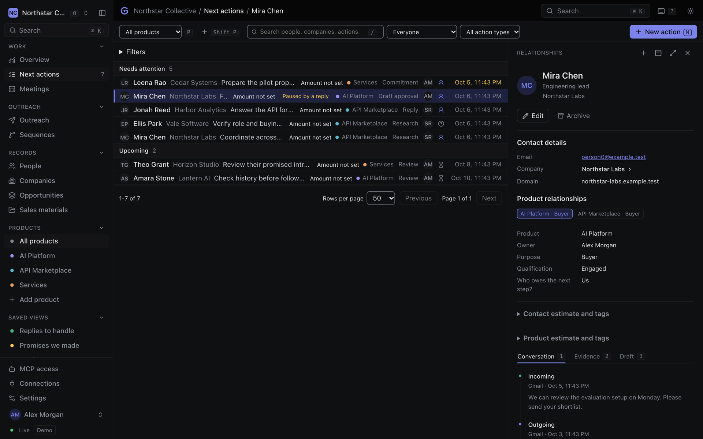
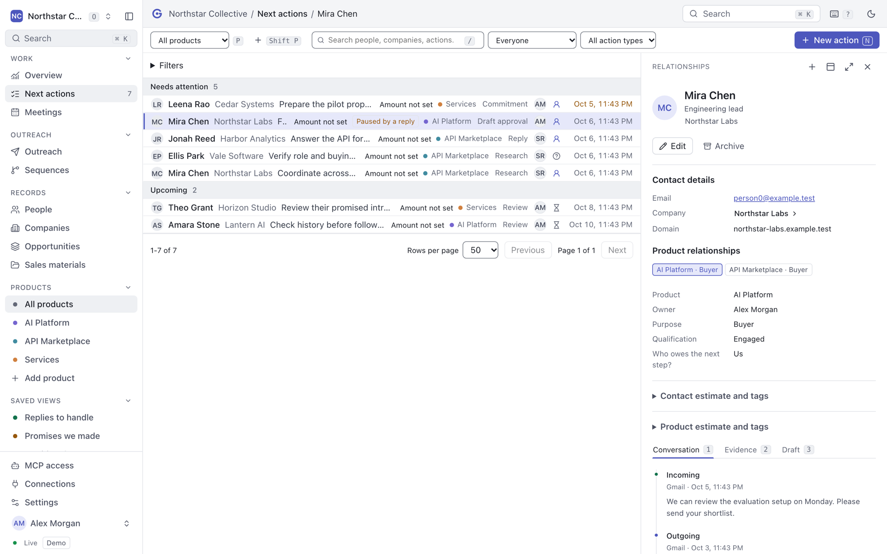
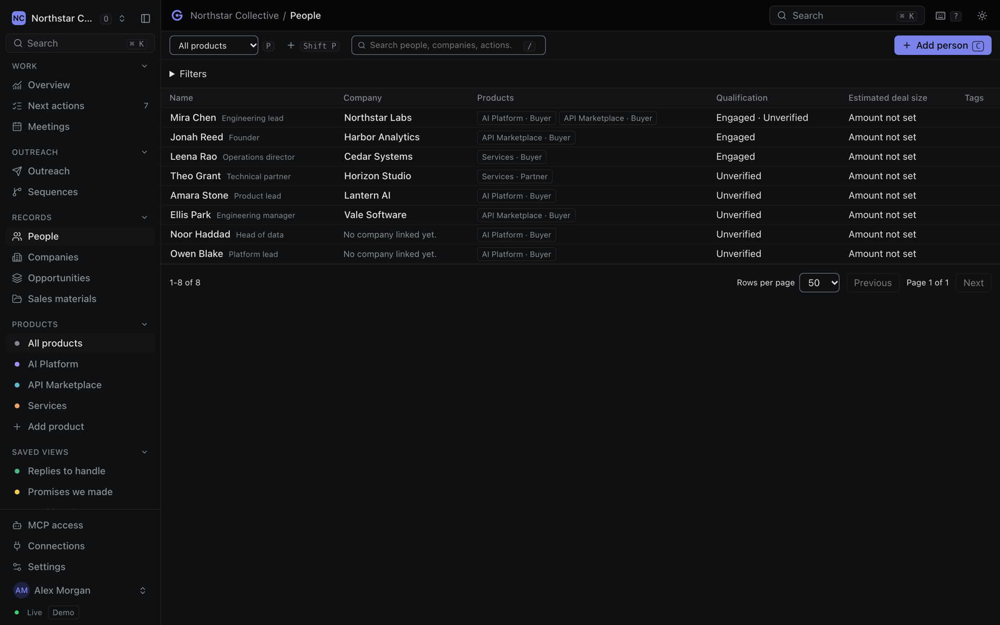
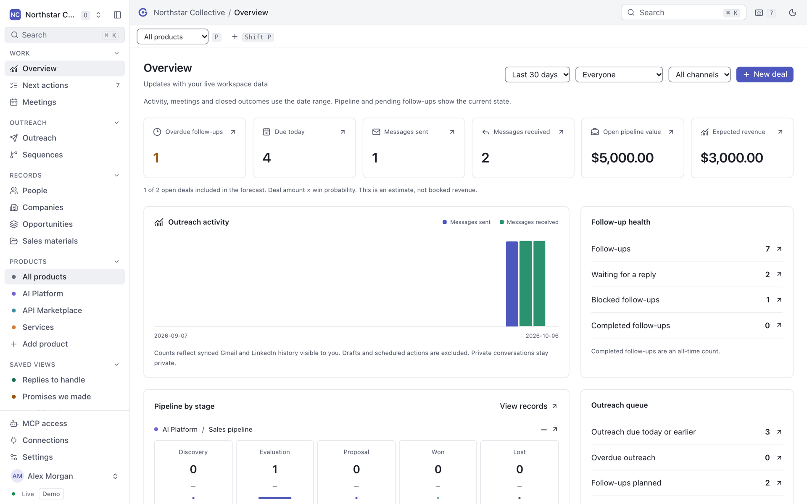
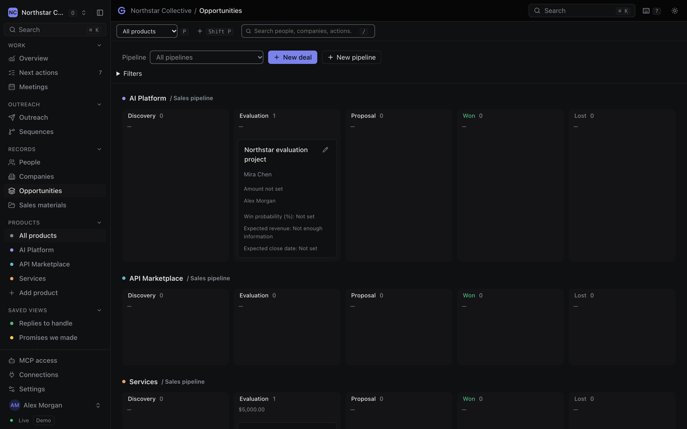

<div align="center">

<picture>
  <source media="(prefers-color-scheme: dark)" srcset="public/brand/gravity-wordmark-dark.svg">
  
</picture>

### The open-source CRM for teams selling more than one product

Replies, outreach and meeting promises turn into one daily queue of next actions,
with the context your team and your AI assistant need to act on them.

[](https://github.com/Noveum/gravity/actions/workflows/ci.yml)
[](LICENSE)
[](https://github.com/Noveum/gravity/labels/good%20first%20issue)
[](CONTRIBUTING.md)
[](https://github.com/Noveum/gravity/stargazers)
[](https://github.com/Noveum/gravity/commits/main)

[**Use it free**](https://gravity.noveum.ai) · [**Docs**](https://gravity.noveum.ai/docs) · [**Quick start**](#quick-start) · [**Connect an assistant**](#for-ai-assistants) · [**Self-host**](#self-host) · [**Contribute**](CONTRIBUTING.md)

</div>

> [!NOTE]
> **Gravity is a Preview.** It is in daily use and developed in the open, but some
> integrations still need live qualification and self-hosting is not yet a
> supported production release. The [roadmap](docs/roadmap.md) lists exactly what
> is finished and what is next.

<div align="center">
  
</div>

## Why Gravity

Most CRMs assume one company sells one product. Real teams sell an evaluation
platform and a services retainer to the same person, through different owners, on
different timelines. In a typical CRM that becomes duplicate contacts, a tangle of
custom fields, or one deal record that hides three conversations.

Gravity keeps **one person** with **a separate relationship for each product**:
its own owner, context, outreach and deals. Every reply, sequence step and promise
made in a meeting becomes a next action in one queue, so the question each morning
is simply "who needs me today, and why?"

It is built for the way sales work is starting to happen, with an AI assistant
alongside. Every business operation in the app is also an MCP tool, running under
the same permissions, so Claude, Codex or any MCP client can prepare your queue,
draft follow-ups and update records without ever seeing more than you shared.

## Screenshots

<table>
<tr>
<td width="50%"><br /><sub><b>Next actions.</b> Replies, promises and follow-ups in one queue, with the reason for each.</sub></td>
<td width="50%"><br /><sub><b>People.</b> One person, a separate relationship for each product you sell them.</sub></td>
</tr>
<tr>
<td width="50%"><br /><sub><b>Overview.</b> Follow-ups, message activity, workload and pipeline, all clickable.</sub></td>
<td width="50%"><br /><sub><b>Deals.</b> Several pipelines per product, with value, probability and outcome.</sub></td>
</tr>
</table>

## What it does

| | |
| --- | --- |
| **Next actions queue** | Replies, promises you made, things you are waiting on and scheduled follow-ups, filtered by product, owner and type |
| **Multi-product relationships** | One canonical person or company, with separate owner, context, outreach and deals per product |
| **Organizations and products** | Several organizations per account and several products per organization, with product-level membership enforced on the server |
| **Team access** | Invitation links that require the recipient's verified email, roles, per-product access and member removal |
| **Conversation inspector** | Imported email, LinkedIn and meeting history beside each action, with private conversations visible only to their owner unless shared |
| **Outreach and sequences** | Drafts bound to recipient, channel and product; approval is invalidated when anything changes, and replies pause follow-ups automatically |
| **Explicit sending** | Approved Gmail and LinkedIn sends with durable idempotency. Nothing sends because a date passed or a webhook arrived |
| **Deals and pipelines** | Several pipelines per product with amount, probability, close date, outcome and loss reason |
| **Overview analytics** | Clickable follow-up, activity, workload and pipeline metrics by product, teammate, channel and date range |
| **Meetings** | Calendar and Fireflies notes enter a private review queue; commitments become owned, dated next actions |
| **File library** | Private, product-scoped folders with document previews and direct-to-storage uploads up to 100 MiB, plus stage-linked sales materials |
| **Connections** | Gmail and primary Calendar, LinkedIn through your own Unipile account, and Fireflies, each authorized by its owner |
| **MCP server** | OAuth with PKCE, organization and product selection, revocable grants, and a tool for every business operation |
| **Keyboard first** | <kbd>Cmd</kbd> <kbd>K</kbd> for the command menu, <kbd>?</kbd> for every shortcut, keyboard movement through every list |
| **Live updates** | Changes appear for teammates within a second, without losing an unsaved draft |
| **Themes** | Light and dark, compact or comfortable density |

## Use it free

Open **[gravity.noveum.ai](https://gravity.noveum.ai)** and sign in with Google,
GitHub or an email code. Create an organization and its first product, add people
and next actions, then connect your own Gmail, Calendar, LinkedIn and Fireflies
accounts from **Connections**. There is nothing to install and no card to enter.

## Quick start

To run Gravity locally you need **Node.js 22.12+** and **[Bun](https://bun.sh) 1.3.14**.
No Docker, database or API keys.

```bash
git clone https://github.com/Noveum/gravity.git
cd gravity
bun install --frozen-lockfile
bun run dev
```

Open <http://127.0.0.1:3014>. The first run creates an embedded PostgreSQL database
in `.data/`, applies migrations and loads fictional workspaces. You are signed in
automatically as a demo user.

- **Northstar Collective** has three products sharing some of the same people.
  Open Next actions, select Mira's follow-up, read her reply and rework the draft.
- **Lunar Studio** is a separate organization, so you can check that nothing leaks.

The demo identity is disabled automatically when `DATABASE_URL` is set or demo
mode is off, so it can never reach production.

## For AI assistants

Gravity's MCP endpoint is `https://gravity.noveum.ai/mcp` (or `/mcp` on your own
deployment). It uses OAuth, so there is no API key to copy.

```bash
claude mcp add --transport http gravity https://gravity.noveum.ai/mcp
```

You choose the organization and products to share and approve the scopes. **An
assistant never has more access than you do**: tools run through the same services
and permission checks as the app, cannot read a teammate's private inbox, and can
only send with the separate `crm:send` scope, a current approval and a stable
idempotency key.

Things that work today:

> "Review today's replies, pause the sequences that got a response, and prepare the
> next follow-ups for each product."
>
> "Brief me on Northstar Labs before my call: open deals, last three conversations,
> and anything we promised."

The [setup guide](docs/setup-and-mcp.md) covers Codex, Claude Code and other
clients, and lists every tool.

## Self-host

Gravity is one Next.js application backed by PostgreSQL and, for file uploads, an
S3-compatible bucket.

[](https://vercel.com/new/clone?repository-url=https%3A%2F%2Fgithub.com%2FNoveum%2Fgravity&project-name=gravity&repository-name=gravity&env=APP_URL%2CDATABASE_URL%2CBETTER_AUTH_SECRET%2CRESEND_API_KEY%2CEMAIL_FROM%2CINTEGRATION_ENCRYPTION_KEY%2CCRON_SECRET%2CCRM_DEMO_MODE%2CDATABASE_SSL_MODE%2CPUBLIC_SITE_INDEXING&envDefaults=%7B%22CRM_DEMO_MODE%22%3A%22false%22%2C%22DATABASE_SSL_MODE%22%3A%22verify-full%22%2C%22PUBLIC_SITE_INDEXING%22%3A%22false%22%7D&envLink=https%3A%2F%2Fgithub.com%2FNoveum%2Fgravity%2Fblob%2Fmain%2Fdocs%2Fvercel.md%23environment)

The button creates your own repository and Vercel project. You bring the database,
secrets and a verified email sender; nothing is shared with the hosted instance.
Migrations are applied separately, by you, with a dedicated migration role.

- [Deploy on Vercel](docs/vercel.md): environment values, callbacks, scheduled sync
- [Supabase PostgreSQL](docs/supabase.md): migrations, restricted runtime role, TLS
- [Setup and OAuth MCP](docs/setup-and-mcp.md): every environment variable

After deploying, `bun run test:deployment https://your-domain.example` checks the
public pages, sign-in, health endpoint, icons and the MCP OAuth challenge.

## Documentation

| | |
| --- | --- |
| [Documentation index](docs/README.md) | Every guide, grouped by what you are doing |
| [Architecture](docs/architecture.md) | Tenant boundaries, the operation registry and storage |
| [Connections](docs/connectors.md) | What each provider imports and how review works |
| [Accounts and privacy](docs/accounts-and-privacy.md) | Who sees which conversations |
| [Overview metrics](docs/analytics.md) | How each number is calculated |
| [Agent access and sending](docs/mcp-permissions-2026-10-06.md) | Scopes, approvals and idempotency |
| [Roadmap](docs/roadmap.md) | Next slices and production gates |

## How it is built

```text
src/app/                 Next.js App Router: pages, HTTP routes, sign-in, OAuth, /mcp
src/components/          Queue, inspector, records, dialogs, command menu
packages/operations/     One definition per business operation, shared by HTTP and MCP
packages/core/           Authorized domain services and permissions
packages/database/       Drizzle schema, PostgreSQL and PGlite clients, fictional seed
packages/auth/           Better Auth: Google, GitHub and email codes
packages/mcp/            MCP server that registers every operation as a tool
packages/connectors/     Gmail, Calendar, Unipile LinkedIn and Fireflies
packages/storage/        Private file storage
packages/i18n/           Interface strings
```

TypeScript in strict mode, Next.js 16, React 19, Drizzle on PostgreSQL, Better
Auth with its MCP plugin, the official MCP server SDK and Zod. Bun is the
toolchain; Node is the runtime.

Every tenant-owned row carries an organization ID and product-owned rows carry a
product ID, enforced with composite foreign keys. Because HTTP and MCP execute the
same operation registry, adding a business operation adds an API route and an
assistant tool with identical validation and permissions.

## Contributing

Contributions are welcome, and not only code: docs, bug reports, translations,
accessibility and design all count.

```bash
bun run verify   # lint, licenses, types, tests, build and public smoke test
```

- [**Good first issues**](https://github.com/Noveum/gravity/labels/good%20first%20issue), small and with file paths in the description
- [**Help wanted**](https://github.com/Noveum/gravity/labels/help%20wanted), bigger pieces we would like a hand with
- [**The roadmap**](docs/roadmap.md), for what comes next

The house rules that will otherwise surprise you in review: Bun only; every
business operation goes in `packages/operations/catalog.ts`, never an HTTP-only
handler; interface strings go in `packages/i18n/translations/en.json`; and fixtures
use fictional data only. The full guide is in [CONTRIBUTING.md](CONTRIBUTING.md),
and [`AGENTS.md`](AGENTS.md) gives coding assistants the same rules.

## Contributors

<a href="https://github.com/Noveum/gravity/graphs/contributors">
  
</a>

## Community

- [**Discussions**](https://github.com/Noveum/gravity/discussions) for questions and ideas
- [**Issues**](https://github.com/Noveum/gravity/issues) for bugs and concrete work
- [**Security**](SECURITY.md) for anything that should not be public

Everyone taking part follows the [Code of Conduct](CODE_OF_CONDUCT.md). If Gravity
is useful to you, a star helps other people find it.

## Sponsor

Gravity is built and hosted by [Noveum AI](https://noveum.ai), which also builds
[Orbit](https://github.com/Noveum/orbit), the free open-source task manager whose
design Gravity follows.

## License

[Apache License 2.0](LICENSE). Use it, run it, change it and ship it,
commercially or otherwise. The [NOTICE](NOTICE) asks only that a public fork picks
its own name. Dependency licenses are listed in
[THIRD_PARTY_NOTICES.md](THIRD_PARTY_NOTICES.md).

<div align="center">
<sub>Built by <a href="https://noveum.ai">Noveum AI</a> and <a href="https://github.com/Noveum/gravity/graphs/contributors">everyone who has contributed</a>.</sub>
</div>
