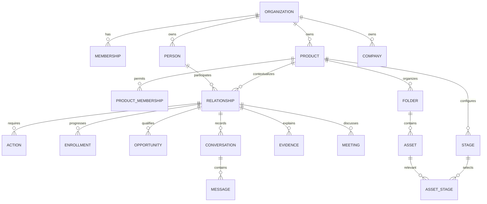

# Architecture and invariants

## The model

Organizations are tenant boundaries. A user can belong to several organizations, with independent roles and product memberships. Identity, companies, evidence, messages, materials, and opportunities never become global shared records. Organization admins can access products in their organization. Members require explicit product membership. A separate organization is appropriate when the teams or data should be isolated; several products in one organization permit coordinated relationships under common membership.

People and companies are canonical within an organization. Relationships add product, owner, purpose, qualification, and context. Mira can be an AI buyer and API partner without one context replacing another. Adding an existing person checks current access before creating a relationship. Creating a duplicate email returns a reviewable conflict instead of silently merging private histories. The current creation service locks the organization row to serialize duplicate checks; future import/identity adapters must preserve that invariant, or introduce a reviewed canonical-identifier constraint.

People/company lists currently include only identities attached to permitted products. Private conversations remain limited to their owner even when the product is shared. Reply actions derived from a private conversation keep the source conversation ID and inherit its visibility. Organizational membership does not turn a private message into a shared one.

## Authorized services

HTTP and MCP call the same `CrmService` and permission functions. Every operation checks active organization membership and accessible products. MCP additionally binds the user to an immutable organization and explicit product list; request arguments cannot widen it. Composite SQL foreign keys prevent a child record from pointing into another tenant/product. There is no PostgreSQL RLS policy yet: privileged direct database access is outside the tested application boundary. Before public multi-tenant launch, add a least-privileged runtime role and tested RLS or an equivalently reviewed database boundary.

No contact creation, approval, due date, or webhook sends a message. The foundation has no dispatch implementation. MCP is read-only. A signed-in human reviews drafts and meeting commitments; the future send command must perform fresh policy checks and reconciliation at execution time.

## Transactions and concurrency

Action edits lock the row and require an expected version. Approval stores a hash of the saved draft plus person/email/channel/product. Editing removes approval. A newly observed inbound reply pauses running enrollments, blocks open approval tasks and approved drafts, and creates or refreshes one reply task for that conversation. Blocked drafts require explicit rework. Rework does not resume the enrollment.

Connector processing locks the authoritative connection, inserts a unique receipt and message, updates enrollment/action state, and appends a change event in one SQL transaction. Unknown thread IDs are persisted as unmatched. Duplicate delivery returns the previous matching status. A retained receipt is not a complete replay worker: classification and retry tooling remain pending.

A reviewed held meeting can produce a commitment once, with a real owner and absolute due instant. A scheduled meeting cannot be treated as held. All mutation events form a durable change log in the same transaction. Private conversation-derived changes retain their source permissions, including revision polling, so a private reply or draft edit does not expose a hidden activity count to a teammate. Invalidation of an otherwise shared action has its own permitted change event. This log currently supports authorized live revision checks; it is not yet a complete audit export or transactional job dispatcher.

## Deployment boundaries

The application and stateless HTTP MCP endpoint run in Node. A supplied managed PostgreSQL database is authoritative in production. Drizzle SQL migrations are applied explicitly after target and backup review; the application does not auto-migrate an external database at boot. PGlite is a single-process local PostgreSQL engine for demo/testing, with persistent disk state; production rejects both this adapter and demo identities.

The browser receives serializable snapshots and refreshes them through authenticated SSE revisions, with immediate same-runtime wakeups and one-second SQL reconciliation. Organization/product switches clear stale data and abort obsolete context requests. Current lists are not paginated or virtualized, so this foundation has not been qualified for hundreds of daily touches or a large history. The next queue slice introduces cursor pagination, indexed searches, bulk review, and bounded counts before high-volume use. WebSocket fan-out can come later without changing domain truth.

Private materials use random object keys, SHA-256 hashes, MIME allowlisting, basic PDF-header/UTF-8 validation, and authorized attachment downloads. Production storage is S3-compatible. PDF parsing, malware scanning, durable upload finalization, object/database cleanup, immutable asset versions, archive/approval workflows, and shares require later implementation. Metadata has a version field but there is not yet asset-version history.

## Identity and future Orbit linking

Google/GitHub login identifies the CRM user; Gmail connection is a distinct authorization with mailbox scopes and token storage. A Google login is not permission to read Gmail. Orbit can later federate the same identity provider, map external subjects explicitly, and link permitted product tasks. CRM sessions, encryption keys, OAuth audiences, and grants remain distinct. Reusing old app cookie secrets or handing an assistant a mailbox credential is not the planned integration.

## Interface direction

Keep the quiet Orbit-inspired sidebar, dense lists, and context inspector. Primary navigation: Next actions, People, Companies, Sequences, Meetings, Opportunities, Sales materials. Organization choice stays visible; product filtering applies to records and files. Commercial stages belong to opportunities, while outreach steps belong to enrollments.

A queue row must explain person, company, product, owner, action, due time, owed-by, and reason. The inspector holds readable conversation history, sourced facts versus hypotheses, and the draft. Production queue work adds keyboard navigation, bulk operations, conflict indicators, pagination, and saved view persistence. Native modal dialogs provide focus containment; the responsive layout stacks the inspector and scrolls tables inside their region.

For materials, use product folders with optional subfolders plus many-to-many stage relevance. A case study can apply to discovery and evaluation without duplicate copies. Product-global knowledge, persona tags, approved revision pointers, validity dates, and stage kits will let agents retrieve the right evidence while preserving provenance and release status. PDFs require extraction before their contents can be supplied to MCP.

Live delivery and conflict semantics are detailed in [the requirements checklist](requirements.md#live-delivery-contract). The in-process bus only wakes an authorized SQL revision check; it is not a distributed message broker.
