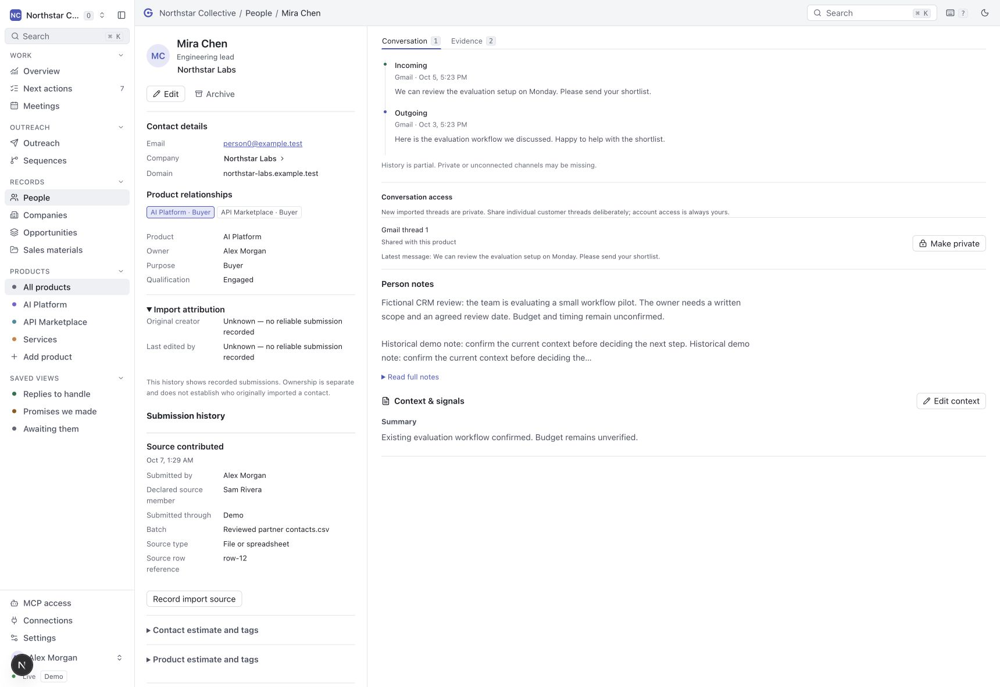
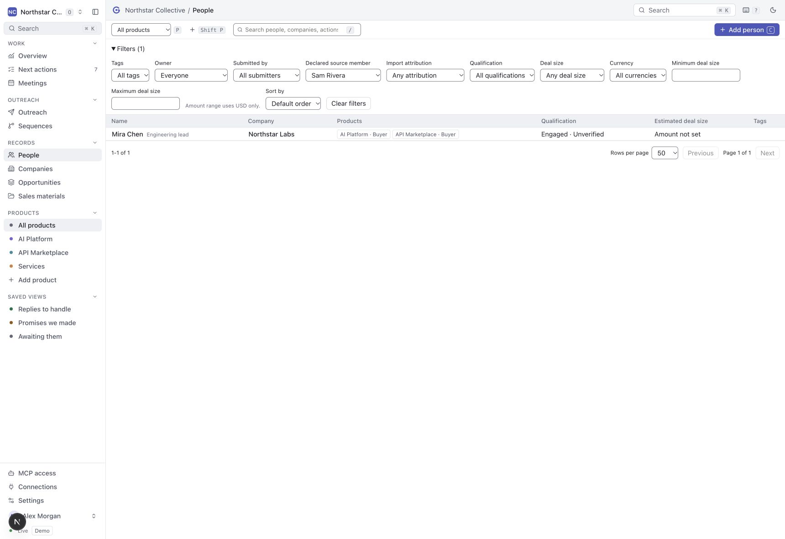

# Contact import attribution

Contacts retain separate records of creation, submissions, declared import sources,
provider ingestion and subsequent contact or relationship edits. Relationship owner
remains the person responsible for the work. Changing ownership does not rewrite
who submitted the contact.

For example, if one member uploads another member's list, the authenticated uploader
is the submitter and the other member is an explicitly **declared source**. The source
declaration is not proof of original authorship. When a member's assistant submits
contacts through verified OAuth MCP, the member, transport, verified client ID and
grant ID come from authentication. Caller-supplied actor claims cannot override them.

Open **Details → Import attribution** in a contact record or inspector to read the original
recorded creator visible in the selected product, most recent recorded editor and
paginated contribution history.
**Record import source** opens an inline form for a reviewed declaration on a
known contact. People
filters distinguish **Submitted by**, **Declared source**, coverage and multiple
contributors independently of current ownership. Multiple contributors means more
than one distinct recorded actor or declared source across visible submissions.
Edits do not count as imports. Filters respect the selected product. Archived
contact records retain readable attribution, with new declarations disabled.

Existing contacts without recorded provenance remain **Unknown**. The migrations
add tables and constraints without rewriting people, relationships, notes, owners
or versions. Historical owner and creation timestamps are insufficient to infer an
importer. Deactivated members retain their recorded names; they lose permission to
submit new data. Names come from the stored member profile; immutable member IDs
retain identity if a profile is renamed. This is recorded history from this feature
onward, not a complete reconstruction of older activity.

## MCP and HTTP import workflow

1. Call `create_contact_import_batch` with `organizationId`, `productId`, a readable
   `label`, `sourceKind` (`file`, `agent` or `manual`), and a stable `submissionKey`.
   Optionally pass `sourceMemberId` for a current member with access to the product.
2. Create each new contact with `create_person` and
   `importSource: {batchId, sourceRecordId}`. Keep each source row ID stable. Exact
   retries return the same contact and relationship; changed payloads for an already
   recorded source row return `IMPORT_SOURCE_CONFLICT`.
3. For a confirmed existing contact already related to the product, call
   `record_contact_import` with its current `version`, `batchId` and `sourceRecordId`.
   This appends provenance without replacing its original creator or owner. Exact
   retries remain safe after later edits. Do not automatically merge contacts by name.
4. Inspect `get_contact_attribution` with a person ID and optional product ID. It
   returns `creator`, `lastEditor`, `items`, `nextOffset` and coverage. Pass the next
   offset to read more history. `list_records` for people supports `submittedBy`,
   `sourceMemberId`, and `attribution: recorded | unknown | shared`.

The shared operation registry maps these to `/api/crm`: POST `import-batch`, POST
`contact-import`, GET `contact-attribution`. Both transports enforce the same
membership, grants, product, version and retry rules. A batch belongs to its
authenticated submitter; another member cannot reuse it. Stable keys identify
retries, not authorization. The source form retains retry keys for unchanged
declarations after a partial failure. Correcting the batch label, kind or declared source creates a new batch;
existing batches remain immutable. Reviewed CSV imports with preview, column mapping, and duplicate review are documented in [CSV imports](csv-imports.md); agents can also submit parsed rows using these operations.

## Provider sources and privacy

Materialized provider messages and meetings record the source connection owner and
provider. Background sync records a system event rather than attributing each event
to a human submitter. An explicit link records the authenticated linking actor,
including MCP identity when applicable. Duplicate provider receipts add no duplicate
contribution. Pending unmatched items become contributions when linked to a contact.

Provider source details and their filter identifiers remain private to the account
owner, even when a conversation has separately been shared. Attribution records
contain no message body, credential or external account handle. Product-shared
manual declarations are visible to authorized product members.

This feature does not change sequence approval, provider consent or sending gates.
Sender and approver remain recorded by existing outreach and delivery operations;
this contact panel is not a unified outbound activity log. Attribution is append-only
through the business API; database administration remains able to alter stored data.

## Migration and validation

Apply generated migrations `0023` and `0024` before running this application version.
They introduce import batches, contributions and same-tenant/product constraints.
Production rollout still requires reviewing the target and backup policy. Tests cover
populated upgrades, retry collisions, actor spoofing, shared submissions, revoked
membership, private accounts, product isolation, MCP provider links and the UI flow.

## Fictional demo screenshots

The local review uses fictional members and contacts. It shows a declared source
without replacing an unknown historical creator, plus the matching People filter.

